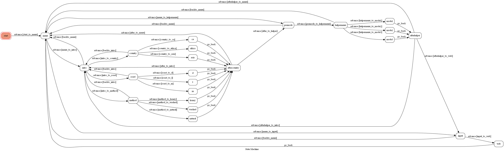

# TOC Project 2021 - coffee bot

    

## Featur of coffee bot
* Brief introdution to speciaty coffee
* Step-by-step instruction to help you make a cup of hand pour coffee (can choose between three kind of technique which emphasized different favor)
* Find what you want to find on ptt coffee forum (using web crawling technique)	 

## FSM

    

## Funtion detail
elaborate the funtion of coffee bot

### introduction
From seed to cup, any cup of coffee has a very complicated process before you drink it.\
Briefly cutting into three main part, it is planting country, process and roast.\
The coffee bot dive into the three main part and introduce to user.\
Also, in each part, we provide different options of information for user.

### hand pour helper
In this section, the coffee bot is going to help you to make a cup of coffee step-by-step.\
We provide three modes: more sourness, more sweetness, or other.

### ptt web crawling
If you are interested of the newest trend in Taiwan, you should always watch ptt.\
Coffee bot provides the function of searching articles on ptt.\
User can find what they want by pressing the keyword on the button or type in their desired key word.

